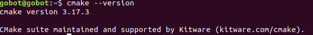
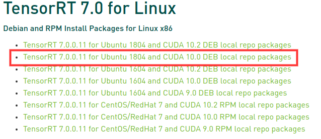
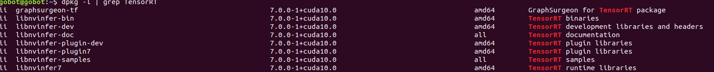
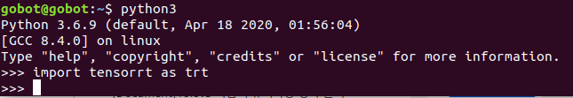
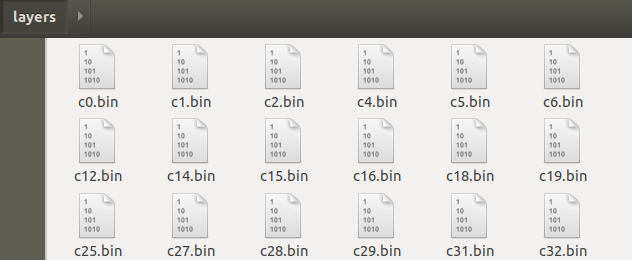
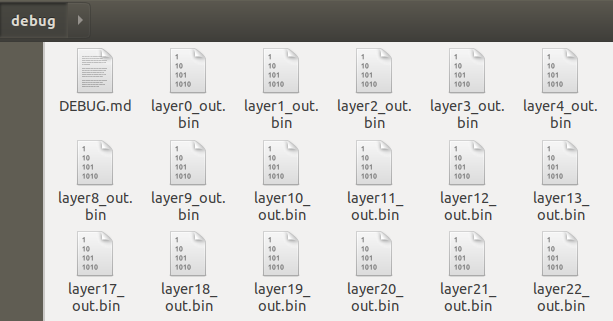
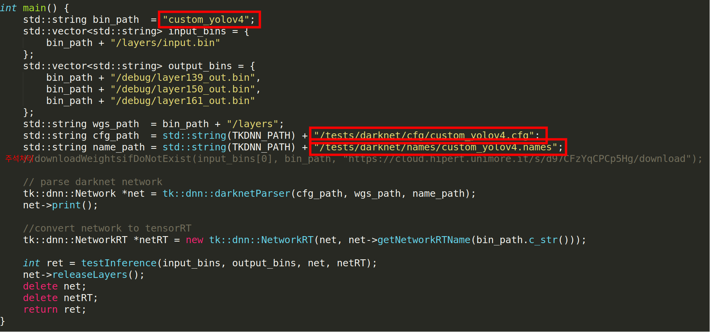
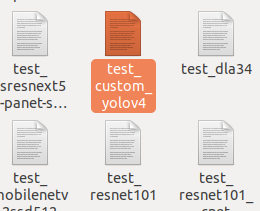
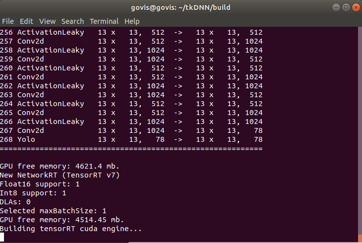
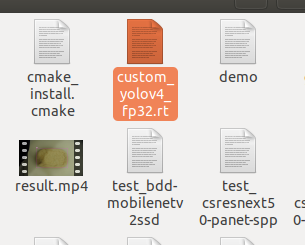

# Yolov4-tkdnn
Guideline Yolov4+tkdnn predict on python (How to speed up yolo v4)

If you've been using YOLOv4 and you want to upgrade your custom YOLO's speed, this repository will help you.   
So,you should already know how to train and predict YOLOv4. This repository will give you guidelines for combining YOLOv4 and tkdnn.    
finally, this repository guides you on how to predict on python your custom data. 

Korean article : https://keyog.tistory.com/33?category=879581

## FPS Results
tkDNN-TensorRT accelerates YOLOv4 **~2x** times for batch=1 and **3x-4x** times for batch=4.
* YOLO,darknet : https://github.com/AlexeyAB/darknet.git
* tkDNN: https://github.com/ceccocats/tkDNN

GeForce RTX 2080 Ti:
| Network Size 	| Darknet, FPS (avg)| tkDNN TensorRT FP32, FPS  | tkDNN TensorRT FP16, FPS  | OpenCV FP16, FPS | tkDNN TensorRT FP16 batch=4, FPS  | OpenCV FP16 batch=4, FPS | tkDNN Speedup |
|:-----:|:--------:|--------:|--------:|--------:|--------:|--------:|------:|
|320	| 100 | 116 | **202** | 183 | 423 | **430** | **4.3x** |
|416	| 82 | 103 | **162** | 159 | 284 | **294** | **3.6x** |
|512	| 69 | 91 | 134 | **138** | 206 | **216** | **3.1x** |
|608 	| 53 | 62 | 103 | **115**| 150 | **150** | **2.8x**  |
|Tiny 416 | 443 | 609 | **790** | 773 | **1774** | 1353 | **3.5x**  |
|Tiny 416 CPU Core i7 7700HQ | 3.4 | - | - | 42 | - | 39 | **12x**  |

Inference FPS of yolov4 with tkDNN, average of 1200 images with the same dimesion as the input size, on 
  * RTX 2080Ti (CUDA 10.2, TensorRT 7.0.0, Cudnn 7.6.5);
  * Xavier AGX, Jetpack 4.3 (CUDA 10.0, CUDNN 7.6.3, tensorrt 6.0.1 );
  * Tx2, Jetpack 4.2 (CUDA 10.0, CUDNN 7.3.1, tensorrt 5.0.6 );
  * Jetson Nano, Jetpack 4.4  (CUDA 10.2, CUDNN 8.0.0, tensorrt 7.1.0 ). 

| Platform   | Network    | FP32, B=1 | FP32, B=4	| FP16, B=1 |	FP16, B=4 |	INT8, B=1 |	INT8, B=4 | 
| :------:   | :-----:    | :-----:   | :-----:   | :-----:   |	:-----:   |	:-----:   |	:-----:   | 
| RTX 2080Ti | yolo4  320 | 118,59	  |237,31	    | 207,81	  | 443,32	  | 262,37	  | 530,93    | 
| RTX 2080Ti | yolo4  416 | 104,81	  |162,86	    | 169,06	  | 293,78	  | 206,93	  | 353,26    | 
| RTX 2080Ti | yolo4  512 | 92,98	    |132,43	    | 140,36	  | 215,17	  | 165,35	  | 254,96    | 
| RTX 2080Ti | yolo4  608 | 63,77	    |81,53	    | 111,39	  | 152,89	  | 127,79	  | 184,72    | 
| AGX Xavier | yolo4 320  |	26,78	    |32,05	    | 57,14	    | 79,05	    | 73,15	    | 97,56     |
| AGX Xavier | yolo4 416  |	19,96	    |21,52	    | 41,01	    | 49,00	    | 50,81	    | 60,61     |
| AGX Xavier | yolo4 512  |	16,58	    |16,98	    | 31,12	    | 33,84	    | 37,82	    | 41,28     |
| AGX Xavier | yolo4 608  |	9,45 	    |10,13	    | 21,92	    | 23,36	    | 27,05	    | 28,93     |
| Tx2        | yolo4 320	| 11,18	    | 12,07	    | 15,32	    | 16,31     | -         | -         |
| Tx2        | yolo4 416	| 7,30	    | 7,58	    | 9,45	    | 9,90      | -         | -         |
| Tx2        | yolo4 512	| 5,96	    | 5,95	    | 7,22	    | 7,23      | -         | -         |
| Tx2        | yolo4 608	| 3,63	    | 3,65	    | 4,67	    | 4,70      | -         | -         |
| Nano       | yolo4 320	| 4,23	    | 4,55	    | 6,14	    | 6,53      | -         | -         |
| Nano       | yolo4 416	| 2,88	    | 3,00	    | 3,90	    | 4,04      | -         | -         |
| Nano       | yolo4 512	| 2,32	    | 2,34	    | 3,02	    | 3,04      | -         | -         |
| Nano       | yolo4 608	| 1,40	    | 1,41	    | 1,92	    | 1,93      | -         | -         |


## Index
+ [Dependencies](#Dependencies)
+ [Prepare for use](#Prepare-for-use)
  + [Upgrade cmake compiler](#Upgrade-cmake-compiler)
  + [Install TensorRT](#Install-TensorRT)
  + [Install tkDnn](#Install-tkDnn)
  + [Run the demo](#Run-the-demo)
+ [Workflow](#Workflow)
+ [How to export weights](#How-to-export-weights)
  + [Export weights from darknet](#Export-weights-from-darknet)
  + [Setting tkDnn](#Setting-tkDnn)
  + [Create RT file](#Create-RT-file)
+ [How to do inference on python](#How-to-do-inference-on-python)
+ [How to change inference data type](#How-to-change-inference-data-type)
+ [References](#References)
  
## Dependencies
+ CUDA 10.0
+ CUDNN >= 7.2
+ TesorRT >= 6.01
+ Opencv >= 3.4.0
+ cmake >= 3.12.2
## Prepare for use
This chapter guides Prepare for use tkDnn.   
You must follow this chapter to complete the installation.    
But if you prepare complete, you can go next chapter.   
### Upgrade cmake compiler
you should check your cmake version this command `cmake --version`    
If you had installed cmake with  `sudo apt-get install cmake` , your cmake version must be `3.10.2`    
However, to build TensorRT and tkDnn, cmake version `3.12.2` or higher is required, so upgrade the cmake version.    
cmake download site : https://cmake.org/download/

Download cmake `3.17.3` version [this link](https://github.com/Kitware/CMake/releases/download/v3.17.3/cmake-3.17.3.tar.gz)    

Remove your cmake old version
```
sudo apt remove cmake
```

Extract cmake `3.17.3`    
```
cd Download    
tar zxvf camke-3.17.3.tar.gz
```

Install cmake `3.17.3`
```
cd cmake-3.17.3    
./bootstrap    
make    
sudo make install
```

Check your cmake version this command `cmake --version`
You can see change your cmake version    


### Install TensorRT
To use tkdnn, you should install TensorRT    
This repository guides install TensorRT 7.0 for Linux using debian    
TensorRT docs : https://docs.nvidia.com/deeplearning/tensorrt/install-guide/index.html#troubleshooting

Download TensorRT 7.0 for Linux [this link](https://developer.nvidia.com/nvidia-tensorrt-7x-download)    
(Nivdia developer login required)

Download the debian package for your computer environment.(my computer has cuda-10.0)    
(You can install with tar file, but in the case of install tar file, installing tkdnn can cause path setting issues, so it is better to install with deb pakages.)    
    

Install TensorRT with deb pakage file, after download complete.    
(Proceed from the /home/<username> location)    
 
```
cp Download/nv-tensorrt-repo-ubuntu1804-cuda10.0-trt7.0.0.11-ga-20191216_1-1_amd64.deb ./

sudo dpkg -i nv-tensorrt-repo-ubuntu1804-cuda10.0-trt7.0.0.11-ga-20191216_1-1_amd64.deb 
sudo apt-key add /var/nv-tensorrt-repo-cuda10.0-trt7.0.0.11-ga-20191216/7fa2af80.pub

sudo apt-get update
sudo apt-get install tensorrt cuda-nvrtc-10-0
```

Install TensorRT support pakages.
```
sudo apt-get install python-libnvinfer-dev
sudo apt-get install python3-libnvinfer-dev
sudo apt-get install uff-converter-tf
```

Check if tensorrt installation is successful.
```
dpkg -l | grep TensorRT
```


Check if tensorrt installation is successful on python3



### Install tkDnn
Install tkDnn very easy.    
```
git clone https://github.com/Keunyoung-Jung/Yolov4-tkdnn.git
cd Yolo-tkdnn/tkdnn
mkdir build
cd build
camke ..
make
```

### Run the demo tkDnn
To run the an object detection demo with python (example with yolov4):    
```
python darknetTR.py build/yolo4_fp16.rt --video=demo/yolo_test.mp4
```

In general the demo program takes 4 parameters:    
```
./demo <network-rt-file> <path-to-video> <kind-of-network> <number-of-classes> <n-batches> <show-flag>
```
N.b. By default it is used FP32 inference    


## Workflow
Steps required to get inference from custom YOLOv4 network with tkdnn
+ Train YOLOv4 your custom data and export best weight.
+ Export weights & bias and ouputs for each layer and save them `.bin`file
+ tkDnn setting for custom network and rebuild tkDnn
+ Create new difine the network `.rt`file
+ Copy `.rt`file and `darknetTR.py` to your directory
+ Do inference on your python code

## How to export weights
This chapter guides export weights for using tkDnn.    
To use tkdnn, you should create new network weights file.    

### Export weights from darknet
Don't touch makefile in darknet.(Do not use GPU params in makefile)    
```
cd Yolov4-tkdnn/darknet
make
mkdir layers debug
./darknet export <path-to-cfg-file> <path-to-weights> layers
```

Check complete export layers and outputs.    
    
    

### Setting tkDnn
Set somthing for TensorRT+tkdnn custom weight.    
```
cd Yolo-tkdnn/tkdnn
cd tests/darknet
cp yolov4.cpp custom_yolov4.cpp
```

Edit some lines for custom weight.    
    

Copy and move your cfg and names file.
```
cp <path-to-cfg-file> ./cfg
cp <path-to-names-file> ./names
```

Rebuild tkDnn.
```
cd Yolov4-tkdnn/tkdnn
cd build
make clean
cmake ..
make
```

Check your excution file has been created.    
    

### Create RT file
Create RT weights file for do inference.
```
cd Yolo-tkdnn/tkdnn
cd build
mkdir custom_yolov4
cp -r ../../darknet/layers ./custom_yolov4/
cp -r ../../darknet/debug ./custom_yolov4/

./test_custom_yolov4
```
     
Check `.rt`file has been created.    

## How to do inference on python
To do inference, you should move to directory where you want to do inference some files
1. `.rt`file, `custom_yolov4.data`, and `custom_yolov4.names`
2. `libdarknet.so` in tkDnn/build directory
3. `darknetTR.py` in tkDnn directory

Input this code in your python code where you need
```{.python}
import darknetTR

detector = darknetTR.YOLO4RT(weight_file='custom_yolov4_fp32.rt',
                             metaPath='custom.data',nms=0.2,conf_thres=0.3)
                             
detections = detector.detect(rgb_frame)
```

If you are not sure, please refer to `example` folder

## How to change inference data type
If you want change inference data type, add line to `.bashrc`file or command
(default FP32 type)
+ FP16 inference 
```
export TKDNN_MODE=FP16
./test_custom_yolov4
```

+ INT8 inference
```
export TKDNN_MODE=INT8
export TKDNN_CALIB_LABEL_PATH=/path/to/calibration/image_list.txt
export TKDNN_CALIB_IMG_PATH=/path/to/calibration/label_list.txt
./test_custom_yolov4
```

N.b Using *FP16* and *INT8* will lead to some errors in the result

## References

https://github.com/AlexeyAB/darknet    
https://github.com/ceccocats/tkDNN    
https://docs.nvidia.com/deeplearning/tensorrt/install-guide/index.html#troubleshooting    
https://github.com/ioir123ju/tkDNN    
https://git.hipert.unimore.it/fgatti/darknet.git    

